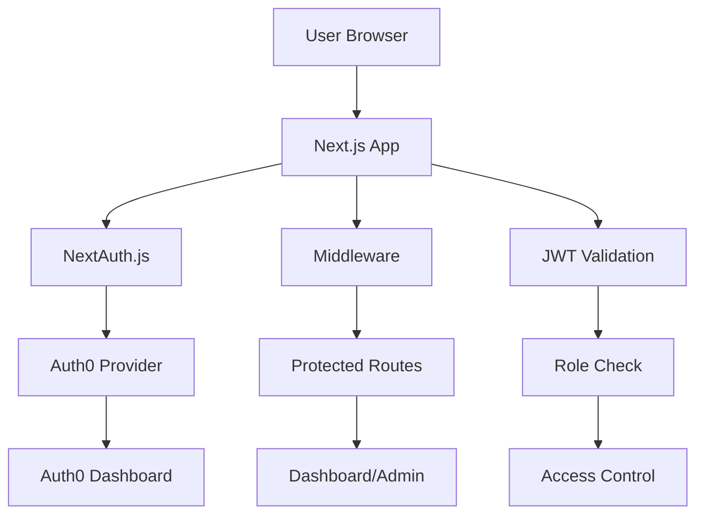

# 🔐 Auth0 + NextAuth.js Authentication System

Next.js 14 ile geliştirilmiş, Auth0 OAuth provider kullanan, JWT tabanlı kimlik doğrulama ve yetkilendirme sistemi. SOLID prensipleri ve 12 Factor App ilkelerine uygun olarak tasarlanmıştır.

> **Frontend 1. Aşama Task**: Auth0 ile OAuth + JWT Entegrasyonu ve Next.js Middleware Yetkilendirme Sistemi

## 🚀 Özellikler

- ✅ **Auth0 OAuth 2.0 Entegrasyonu** - Güvenli kimlik doğrulama
- ✅ **NextAuth.js** - Oturum yönetimi ve JWT token handling
- ✅ **Next.js 14 App Router** - Modern React framework
- ✅ **TypeScript** - Tip güvenliği
- ✅ **TailwindCSS** - Modern UI tasarımı
- ✅ **Middleware Route Protection** - Sayfa erişim kontrolü
- ✅ **SOLID Principles** - Temiz kod mimarisi
- ✅ **12 Factor App** - Cloud-native uygulama prensipleri
- ✅ **Responsive Design** - Mobil uyumlu arayüz

## 🏗️ Mimari



## 📦 Teknolojiler

| Teknoloji | Versiyon | Amaç |
|-----------|----------|------|
| Next.js | 14.0.0 | React Framework |
| NextAuth.js | 4.24.5 | Authentication |
| Auth0 | Latest | OAuth Provider |
| TypeScript | 5.2.2 | Type Safety |
| TailwindCSS | 3.3.3 | Styling |
| React | 18.2.0 | UI Library |

## 🛠️ Kurulum

### Gereksinimler
- Node.js 18+ 
- npm veya yarn
- Auth0 hesabı

### 1. Repository'yi klonlayın
```bash
git clone https://github.com/hamzaince6/auth0-nextauth-authentication-system.git
cd auth0-nextauth-authentication-system
```

### 2. Bağımlılıkları yükleyin
```bash
npm install
# veya
yarn install
```

### 3. Environment variables'ları ayarlayın
`.env.local` dosyası oluşturun:

```env
# NextAuth Configuration
NEXTAUTH_URL=http://localhost:3000
NEXTAUTH_SECRET=your-nextauth-secret-key

# Auth0 Configuration
AUTH0_CLIENT_ID=your-auth0-client-id
AUTH0_CLIENT_SECRET=your-auth0-client-secret
AUTH0_ISSUER_BASE_URL=https://your-domain.auth0.com

# Development Configuration
NODE_ENV=development
ENABLE_AUTH=true
```

### 4. Auth0 Konfigürasyonu
1. [Auth0 Dashboard](https://manage.auth0.com/)'a giriş yapın
2. Yeni Application oluşturun (Single Page Application)
3. Allowed Callback URLs: `http://localhost:3000/api/auth/callback/auth0`
4. Allowed Logout URLs: `http://localhost:3000`
5. Client ID ve Client Secret'ı `.env.local`'a ekleyin

### 5. Uygulamayı çalıştırın
```bash
npm run dev
# veya
yarn dev
```

Uygulama [http://localhost:3000](http://localhost:3000) adresinde çalışacaktır.

## 📁 Proje Yapısı

```
Task-1/
├── app/                          # Next.js App Router
│   ├── api/                      # API Routes
│   │   └── auth/                 # NextAuth API
│   ├── auth/                     # Auth pages
│   ├── dashboard/                # Protected dashboard
│   ├── login/                    # Login page
│   ├── globals.css              # Global styles
│   ├── layout.tsx               # Root layout
│   └── page.tsx                 # Home page
├── components/                   # Reusable components
│   ├── auth/                    # Auth components
│   ├── layout/                  # Layout components
│   └── ui/                      # UI components
├── lib/                         # Utility libraries
│   └── auth/                    # Auth utilities
├── types/                       # TypeScript types
├── hooks/                       # Custom hooks
├── middleware.ts                # Route protection
├── documentation/               # Project documentation
└── package.json                 # Dependencies
```

## 🔐 Authentication Flow

### 1. Login Süreci
```
1. User clicks "Login"
2. Redirect to Auth0 Universal Login
3. User enters credentials
4. Auth0 validates user
5. Redirect back with authorization code
6. NextAuth exchanges code for tokens
7. Create session cookie
8. Redirect to dashboard
```

### 2. Protected Route Access
```
1. User requests protected route
2. Middleware checks session
3. If no session → redirect to login
4. If session exists → validate JWT
5. Check user role/permissions
6. Allow or deny access
```

## 🛡️ Güvenlik Özellikleri

- **JWT Token Validation** - Güvenli token doğrulama
- **Session Management** - Oturum yönetimi
- **Route Protection** - Middleware ile sayfa koruması
- **OAuth 2.0** - Industry standard authentication
- **HTTPS Only** - Production'da güvenli bağlantı
- **CSRF Protection** - Cross-site request forgery koruması

## 🎨 UI/UX Özellikleri

- **Modern Design** - TailwindCSS ile modern arayüz
- **Responsive Layout** - Mobil uyumlu tasarım
- **Loading States** - Kullanıcı deneyimi için loading durumları
- **Error Handling** - Kullanıcı dostu hata mesajları
- **Accessibility** - Erişilebilirlik standartları

## 🧪 Test

```bash
# Linting
npm run lint

# Type checking
npx tsc --noEmit

# Build test
npm run build
```

## 🚀 Deployment

### Vercel (Önerilen)
1. Vercel hesabı oluşturun
2. GitHub repository'yi bağlayın
3. Environment variables'ları ayarlayın
4. Deploy edin

### Netlify
1. Netlify hesabı oluşturun
2. GitHub repository'yi bağlayın
3. Build command: `npm run build`
4. Publish directory: `.next`
5. Environment variables'ları ayarlayın

### Docker
```dockerfile
FROM node:18-alpine
WORKDIR /app
COPY package*.json ./
RUN npm ci --only=production
COPY . .
RUN npm run build
EXPOSE 3000
CMD ["npm", "start"]
```

## 📚 Dokümantasyon

Detaylı dokümantasyon için `documentation/` klasörüne bakın:

- [Architecture](./documentation/architecture.md) - Sistem mimarisi
- [Auth0 Setup](./documentation/auth0-setup.md) - Auth0 kurulum rehberi
- [12 Factor App](./documentation/12factor-compliance.md) - 12 Factor uyumluluğu
- [API Docs](./documentation/api-docs.md) - API dokümantasyonu
- [Testing](./documentation/testing.md) - Test stratejileri

## 🔧 Geliştirme

### Branch Strategy
- `main` - Production branch
- `dev/v1.0.0` - Development branch
- `feature/*` - Feature branches

### Commit Convention
```
feat: add new authentication feature
fix: resolve login redirect issue
docs: update README
style: format code
refactor: improve auth flow
test: add unit tests
```

## 🤝 Katkıda Bulunma

1. Fork edin
2. Feature branch oluşturun (`git checkout -b feature/amazing-feature`)
3. Değişikliklerinizi commit edin (`git commit -m 'feat: add amazing feature'`)
4. Branch'inizi push edin (`git push origin feature/amazing-feature`)
5. Pull Request oluşturun

## 📄 Lisans

Bu proje MIT lisansı altında lisanslanmıştır. Detaylar için [LICENSE](LICENSE) dosyasına bakın.

## 🆘 Destek

- **Issues**: [GitHub Issues](https://github.com/hamzaince6/auth0-nextauth-authentication-system/issues)
- **Documentation**: [Documentation](./documentation/)
- **Auth0 Support**: [Auth0 Documentation](https://auth0.com/docs)

## 🏷️ Topics

```
nextjs, auth0, nextauth, jwt, authentication, oauth, typescript, tailwindcss, solid-principles, 12-factor-app, middleware, session-management, micro-frontend, task1
```

## 🎯 Proje Hedefleri

Bu proje, **Frontend 1. Aşama** gereksinimlerini karşılamak üzere geliştirilmiştir:

### ✅ Karşılanan Gereksinimler
- Auth0 OAuth provider entegrasyonu
- NextAuth.js ile JWT tabanlı oturum yönetimi
- Next.js 14 App Router kullanımı
- Middleware ile sayfa erişim kontrolü
- TypeScript ile tip güvenliği
- TailwindCSS ile modern UI
- SOLID prensiplerine uygun mimari
- 12 Factor App ilkelerine uyumluluk

### 🔄 Geliştirilecek Özellikler
- Rol bazlı yetkilendirme (admin/user)
- Docker containerization
- Kapsamlı test coverage
- Git workflow (dev/v1.0.0, prod/v1.0.0 branches)

## 📊 Proje Durumu

### ✅ Tamamlanan Özellikler
- ✅ Auth0 OAuth 2.0 Entegrasyonu
- ✅ NextAuth.js Konfigürasyonu
- ✅ Middleware Route Protection
- ✅ TypeScript Desteği
- ✅ TailwindCSS UI
- ✅ SOLID Principles
- ✅ 12 Factor App Compliance
- ✅ JWT Token Management
- ✅ Session Management
- ✅ Responsive Design

### 🔄 Geliştirme Aşamasında
- 🔄 Role-based Authorization (Admin/User)
- 🔄 Docker Support
- 🔄 Unit Tests
- 🔄 Integration Tests

### 📋 Gereksinim Karşılama Durumu
| Gereksinim | Durum | Açıklama |
|------------|-------|----------|
| Auth0 OAuth Entegrasyonu | ✅ | Tam implementasyon |
| NextAuth.js | ✅ | JWT strategy ile |
| Middleware Protection | ✅ | Route koruması |
| TypeScript | ✅ | Tam tip desteği |
| TailwindCSS | ✅ | Modern UI |
| SOLID Principles | ✅ | Temiz mimari |
| 12 Factor App | ✅ | Cloud-native |
| Git Workflow | ❌ | Branch strategy eksik |
| Role System | ❌ | Admin/User rolleri eksik |
| Docker | ❌ | Containerization eksik |

---

**Geliştirici**: [Hamza İnce](https://github.com/hamzaince6)  
**Son Güncelleme**: 2025  
**Versiyon**: 1.0.0 