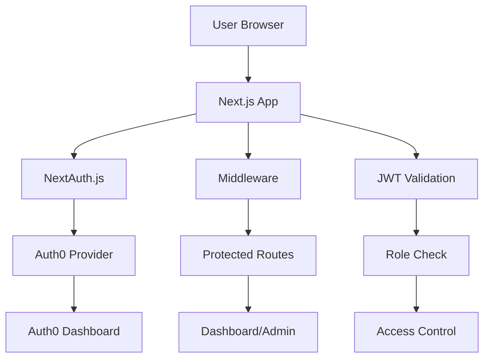

# Sistem Mimarisi

## 🏗 Genel Mimari



## 📦 Katmanlar (Layers)

### 1. Presentation Layer (UI)
- **Login Components** - Auth0 Universal Login
- **Dashboard Components** - Kullanıcı arayüzü
- **Admin Components** - Yönetici paneli
- **Layout Components** - Genel düzen

### 2. Authentication Layer
- **NextAuth.js** - Oturum yönetimi
- **Auth0 Provider** - OAuth sağlayıcı
- **JWT Handler** - Token işlemleri
- **Session Management** - Oturum kontrolü

### 3. Authorization Layer
- **Middleware** - Route koruması
- **Role Based Access** - Rol bazlı erişim
- **Permission Checks** - İzin kontrolleri
- **Protected Routes** - Korumalı sayfalar

### 4. Data Layer
- **User Session** - Kullanıcı oturum verileri
- **JWT Tokens** - Access/Refresh tokenlar
- **User Profile** - Kullanıcı profil bilgileri

## 🔄 Authentication Flow

### 1. Login Süreci
```
1. User clicks "Login"
2. Redirect to Auth0 Universal Login
3. User enters credentials
4. Auth0 validates user
5. Redirect back with authorization code
6. NextAuth exchanges code for tokens
7. Create session cookie
8. Redirect to dashboard
```

### 2. Protected Route Access
```
1. User requests protected route
2. Middleware checks session
3. If no session → redirect to login
4. If session exists → validate JWT
5. Check user role/permissions
6. Allow or deny access
```

### 3. Token Refresh
```
1. JWT expires
2. NextAuth automatically refreshes
3. New tokens stored in session
4. User continues seamlessly
```

## 🎯 SOLID Prensipleri Uygulaması

### Single Responsibility Principle (SRP)
- **AuthProvider** - Sadece authentication logic
- **RoleChecker** - Sadece rol kontrolü
- **TokenValidator** - Sadece token doğrulama
- **RouteGuard** - Sadece route koruması

### Open/Closed Principle (OCP)
- Provider'lar için interface kullanımı
- Yeni OAuth provider'lar kolayca eklenebilir
- Authentication strategy'leri genişletilebilir

### Liskov Substitution Principle (LSP)
- Auth provider interface'i için tutarlı implementasyon
- Role checker'lar birbiriyle değiştirilebilir

### Interface Segregation Principle (ISP)
- AuthProvider interface
- RoleProvider interface
- TokenProvider interface
- Her interface sadece ilgili metodları içerir

### Dependency Inversion Principle (DIP)
- High-level modules Auth0'a bağımlı değil
- Interface'ler üzerinden bağımlılık
- Dependency injection kullanımı

## 🏭 12 Factor App Uyumu

### 1. Codebase
- ✅ Tek repository, multiple environments

### 2. Dependencies
- ✅ package.json ile explicit dependencies
- ✅ npm/yarn ile dependency management

### 3. Config
- ✅ Environment variables (.env)
- ✅ Runtime'da configuration

### 4. Backing Services
- ✅ Auth0 as attached resource
- ✅ Database connections via environment

### 5. Build, Release, Run
- ✅ Ayrı build/release/run stages
- ✅ next build → next start

### 6. Processes
- ✅ Stateless processes
- ✅ Session data in external store

### 7. Port Binding
- ✅ Next.js self-contained server
- ✅ PORT environment variable

### 8. Concurrency
- ✅ Horizontal scaling ready
- ✅ Stateless authentication

### 9. Disposability
- ✅ Fast startup
- ✅ Graceful shutdown

### 10. Dev/Prod Parity
- ✅ Same Auth0 setup for all environments
- ✅ Environment-specific configurations

### 11. Logs
- ✅ NextAuth debug logging
- ✅ Auth0 monitoring logs

### 12. Admin Processes
- ✅ User management via Auth0 dashboard
- ✅ One-off tasks as separate scripts

## 🛡 Güvenlik Mimarisi

### JWT Security
- **Signing Algorithm:** RS256
- **Token Expiration:** 1 hour
- **Refresh Tokens:** 7 days
- **Secure Storage:** HTTP-only cookies

### Route Protection
- **Middleware Level:** Next.js middleware
- **Component Level:** HOC wrappers
- **API Level:** Route handlers

### CSRF Protection
- **CSRF Tokens:** NextAuth built-in
- **SameSite Cookies:** Strict mode
- **Origin Validation:** Middleware

## 📊 Performance Considerations

### Caching Strategy
- **Session Cache:** Redis (production)
- **JWT Validation:** In-memory cache
- **Static Assets:** CDN

### Optimization
- **Code Splitting:** Next.js automatic
- **Bundle Size:** Tree shaking
- **SSR/SSG:** Next.js optimizations

## 🔧 Deployment Architecture

### Development
```
localhost:3000 → Next.js Dev Server
└── Auth0 Dev Application
```

### Production
```
Domain → CDN → Load Balancer → Next.js App
                              └── Auth0 Prod Application
```

### Environment Variables
```
Development:
- AUTH0_BASE_URL=http://localhost:3000
- NEXTAUTH_URL=http://localhost:3000

Production:
- AUTH0_BASE_URL=https://yourdomain.com  
- NEXTAUTH_URL=https://yourdomain.com
```